# Центр автоматизации на n8n

Итоговый учебно-портфолийный проект курса по n8n: единый workflow объединяет RAG-поиск, генерацию ответа, запуск по расписанию, email-уведомления, создание платёжных ссылок Robokassa и централизованную обработку ошибок.

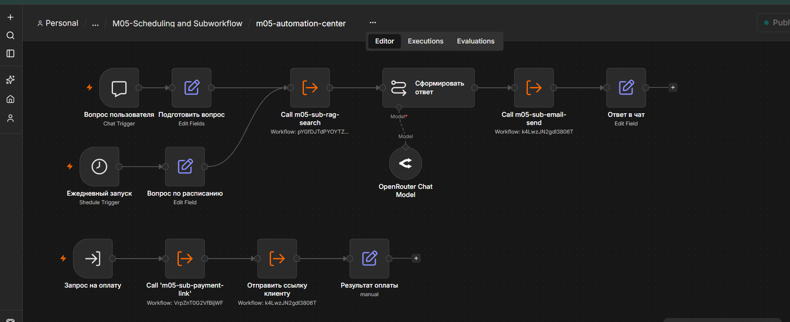

## Задача проекта

Создать модульную систему автоматизации, в которой повторно используемые операции вынесены в отдельные sub-workflow, а главный workflow управляет несколькими независимыми процессами:

- отвечает на вопросы пользователя по базе знаний;
- запускает задачи ежедневно по расписанию;
- отправляет письма через UniSender;
- создаёт тестовые платёжные ссылки Robokassa;
- отправляет ссылку на оплату клиенту;
- централизованно обрабатывает ошибки.

## Архитектура

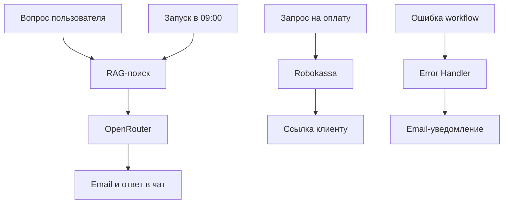

Главный workflow не содержит всю бизнес-логику внутри одной длинной цепочки. Поиск, отправка почты и создание платёжной ссылки вынесены в отдельные вызываемые сценарии.

## Реализованные процессы

### 1. RAG-ответ пользователю

Пользователь задаёт вопрос в Chat Trigger. Запрос передаётся в отдельный RAG sub-workflow, после чего OpenRouter формирует ответ на основе найденного контекста.

Контрольный вопрос:

> Сколько стоит первая консультация?

Полученный ответ:

> Первая консультация стоит 2500 рублей.

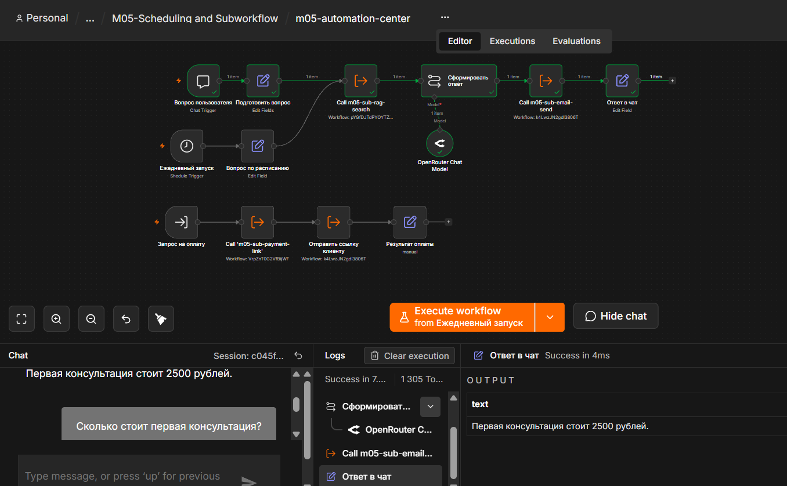

### 2. Запуск по расписанию

Schedule Trigger запускает подготовленный запрос ежедневно в 09:00. Успешная работа расписания подтверждена фактическим получением автоматического письма.

### 3. Email через UniSender

Отправка писем вынесена в `m05-sub-email-send`. Sub-workflow принимает:

- `recipient_email`;
- `subject`;
- `message`.

В результате основной сценарий использует единый почтовый модуль для обычных ответов, платёжных ссылок и уведомлений об ошибках.

### 4. Платёжная ссылка Robokassa

Платёжная ветка принимает:

- номер заказа;
- сумму;
- описание;
- email клиента.

Sub-workflow создаёт подпись, формирует URL Robokassa и возвращает готовую платёжную ссылку.

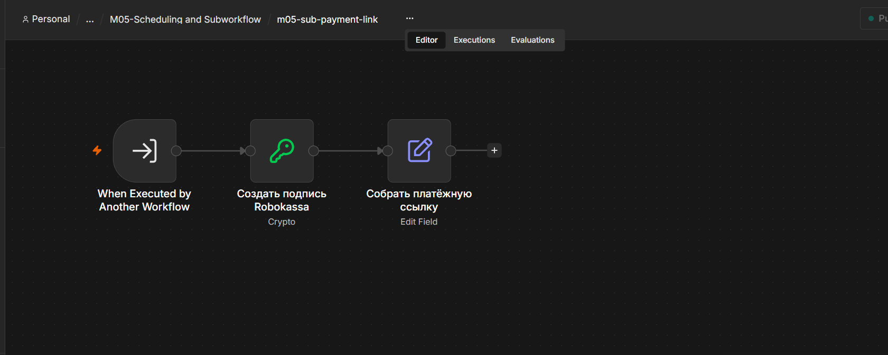

Контрольный тест:

| Параметр | Значение |
|---|---|
| Номер заказа | `5` |
| Сумма | `2500.00` |
| Режим | `IsTest=1` |
| Отправка письма | `success` |

Боевая оплата намеренно не включена: проект ожидает активации магазина Robokassa.

### 5. Централизованная обработка ошибок

`m05-error-handler` принимает сведения об ошибке, подготавливает понятное уведомление и вызывает общий почтовый sub-workflow.

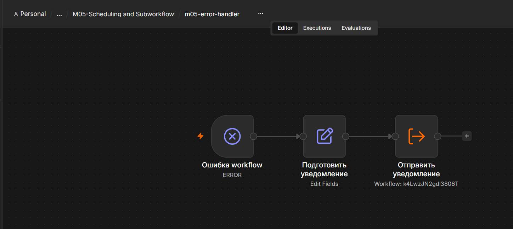

Такой подход позволяет не создавать отдельную обработку ошибок внутри каждого рабочего сценария.

## Состав проекта

| Файл | Назначение |
|---|---|
| `m05-automation-center.json` | Главный управляющий workflow |
| `m05-sub-rag-search.json` | Поиск контекста в базе знаний |
| `m05-sub-email-send.json` | Универсальная отправка писем |
| `m05-sub-payment-link.json` | Формирование ссылки Robokassa |
| `m05-error-handler.json` | Централизованная обработка ошибок |

Экспортированные workflow находятся в папке [`workflows`](workflows).
## Подтверждение выполнения домашнего задания

### Краткий комментарий

Центр автоматизации обрабатывает вопросы клиентов через RAG-поиск, формирует ответы с помощью языковой модели, ежедневно запускает информационную рассылку и создаёт тестовые платёжные ссылки Robokassa.

Повторяемая логика разделена на Subworkflow:

- `m05-sub-rag-search` — поиск информации в базе знаний Qdrant;
- `m05-sub-email-send` — отправка писем и уведомлений;
- `m05-sub-payment-link` — создание подписи и платёжной ссылки Robokassa.

При сбое основной workflow, RAG-поиск или платёжный Subworkflow запускают `m05-error-handler`. Он получает название workflow, проблемную ноду, текст ошибки и ссылку на выполнение, после чего отправляет уведомление по email.

Почтовый Subworkflow намеренно не связан с этим же Error Workflow. Это исключает повторный вызов обработчика, если ошибка возникнет при отправке самого уведомления.

Расписание `09:00` выбрано для ежедневной отправки актуальной информации перед началом рабочего дня.

### Соответствие требованиям

| Требование | Подтверждение |
|---|---|
| Основной сценарий | `01-automation-center-canvas.png` |
| Созданный Subworkflow | `03-payment-subworkflow-canvas.png` |
| Настроенный Error Workflow | `04-error-handler-canvas.png` |
| Error Workflow в основном сценарии | `05-main-error-workflow-setting.png` |
| Error Workflow в Subworkflow | `06-subworkflow-error-setting.png` |
| Schedule Trigger на 09:00 | `07-schedule-trigger-settings.png` |
| Ручной запуск | `02-rag-chat-success.png` |
| Запуск по расписанию | `08-scheduled-run-success.png` |
| Контролируемая ошибка | `09-controlled-error-test.png` |
| Email-уведомление об ошибке | `10-error-notification-email.png` |

### Привязка Error Workflow

В настройках основного сценария выбран централизованный обработчик `m05-error-handler`.

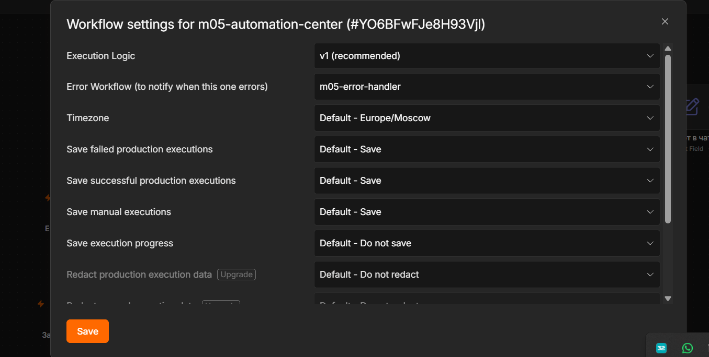

Такая же привязка настроена для рабочих Subworkflow.

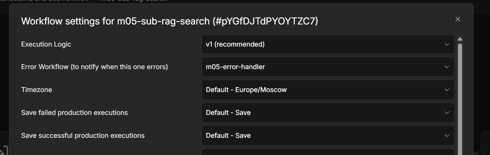

### Запуск по расписанию

Schedule Trigger запускает сценарий ежедневно в `09:00` по часовому поясу `Europe/Moscow`.

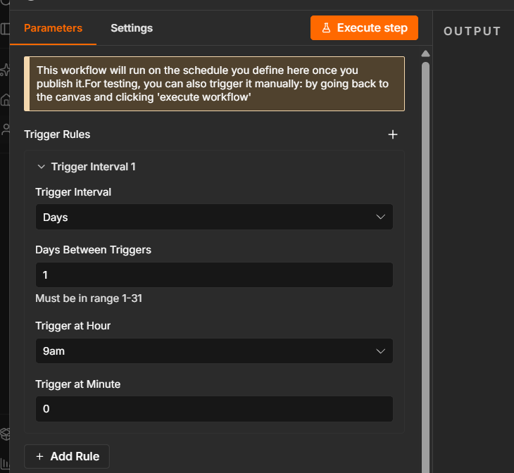

Успешное выполнение ветки по расписанию:

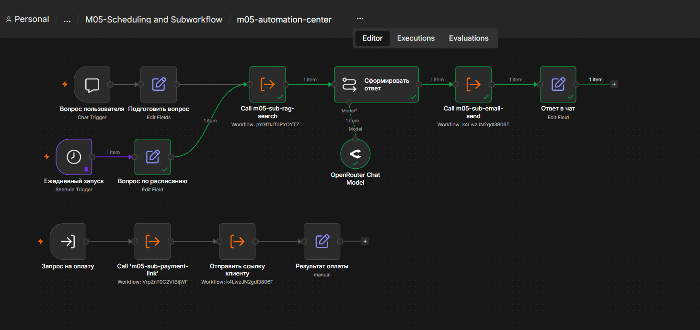

### Проверка обработки ошибок

Для проверки была временно добавлена нода `Stop and Error` с контролируемой ошибкой. После получения подтверждения тестовая нода удалена, а рабочая версия workflow повторно опубликована.

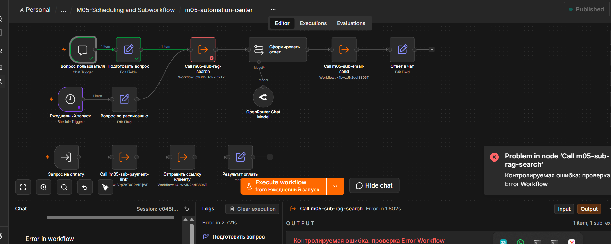

Error Workflow успешно сформировал и отправил уведомление с названием workflow, проблемной нодой и текстом ошибки.

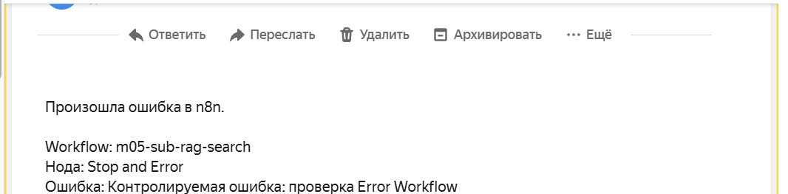

### Проверка трёх режимов

Система проверена во всех требуемых режимах:

1. Ручной запуск — RAG-поиск вернул корректный ответ.
2. Запуск по расписанию — цепочка автоматически выполнилась в `09:00`.
3. Тестовая ошибка — `m05-error-handler` отправил email-уведомление.

### Robokassa

Платёжная ветка протестирована в безопасном режиме `IsTest=1`: подпись сформирована, тестовая ссылка создана и отправлена клиенту по email.

Производственная активация магазина Robokassa не входит в условия домашнего задания и вынесена за рамки учебного проекта.

## Использованные технологии

- n8n;
- JavaScript expressions;
- RAG;
- Qdrant;
- OpenRouter;
- UniSender;
- Robokassa;
- Schedule Trigger;
- Execute Sub-workflow;
- Error Trigger;
- JSON;
- Git и GitHub.

## Проверенные результаты

- RAG-ветка возвращает корректный ответ из базы знаний;
- OpenRouter формирует итоговый текст;
- письмо успешно отправляется через UniSender;
- расписание срабатывает ежедневно в 09:00;
- Robokassa формирует подписанную тестовую ссылку;
- платёжная ссылка отправляется клиенту;
- главный workflow получает структурированный результат;
- ошибки передаются в отдельный Error Handler.

## Импорт и настройка

1. Импортировать JSON-файлы из папки `workflows` в n8n.
2. Создать собственные Credentials для подключаемых сервисов.
3. Повторно выбрать вызываемые workflow в нодах Execute Sub-workflow.
4. Заменить безопасные шаблоны:
   - `YOUR_MERCHANT_LOGIN`;
   - `YOUR_PASSWORD_1`;
   - `sender@example.com`;
   - `client@example.com`;
   - `admin@example.com`.
5. Для тестирования Robokassa оставить `IsTest=1`.
6. Настроить Error Workflow в параметрах главного сценария.
7. Выполнить контрольные тесты каждой ветки.

## Безопасность

Публичная версия проекта не содержит:

- API-ключей;
- токенов;
- паролей;
- реальных платёжных реквизитов;
- реальных email-адресов;
- закреплённых тестовых данных.

Все чувствительные значения заменены безопасными шаблонами. Credentials необходимо создавать отдельно после импорта.

## Полученные навыки

В ходе проекта отработаны:

- разделение большого процесса на независимые модули;
- передача структурированных данных между workflow;
- повторное использование общей логики;
- работа с RAG и языковой моделью;
- автоматический запуск по расписанию;
- формирование подписанных платёжных URL;
- отправка транзакционных писем;
- централизованная обработка ошибок;
- тестирование и безопасная подготовка workflow к публикации.

## Статус

Проект завершён и протестирован в учебном режиме.

Переход Robokassa в боевой режим будет выполнен после активации магазина и отдельного минимального контрольного платежа.