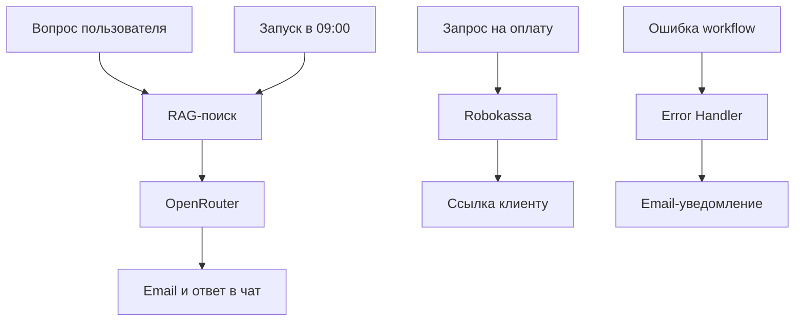

# Центр автоматизации на n8n

Итоговый учебно-портфолийный проект курса по n8n: единый workflow объединяет RAG-поиск, генерацию ответа, запуск по расписанию, email-уведомления, создание платёжных ссылок Robokassa и централизованную обработку ошибок.

## Задача проекта

Создать модульную систему автоматизации, в которой повторно используемые операции вынесены в отдельные sub-workflow, а главный workflow управляет несколькими независимыми процессами:

- отвечает на вопросы пользователя по базе знаний;
- запускает задачи ежедневно по расписанию;
- отправляет письма через UniSender;
- создаёт тестовые платёжные ссылки Robokassa;
- отправляет ссылку на оплату клиенту;
- централизованно обрабатывает ошибки.

## Архитектура

Главный workflow не содержит всю бизнес-логику внутри одной длинной цепочки. Поиск, отправка почты и создание платёжной ссылки вынесены в отдельные вызываемые сценарии.

## Реализованные процессы

### 1. RAG-ответ пользователю

Пользователь задаёт вопрос в Chat Trigger. Запрос передаётся в отдельный RAG sub-workflow, после чего OpenRouter формирует ответ на основе найденного контекста.

Контрольный вопрос:

> Сколько стоит первая консультация?

Полученный ответ:

> Первая консультация стоит 2500 рублей.

### 2. Запуск по расписанию

Schedule Trigger запускает подготовленный запрос ежедневно в 09:00. Успешная работа расписания подтверждена фактическим получением автоматического письма.

### 3. Email через UniSender

Отправка писем вынесена в `m05-sub-email-send`. Sub-workflow принимает:

- `recipient_email`;
- `subject`;
- `message`.

В результате основной сценарий использует единый почтовый модуль для обычных ответов, платёжных ссылок и уведомлений об ошибках.

### 4. Платёжная ссылка Robokassa

Платёжная ветка принимает:

- номер заказа;
- сумму;
- описание;
- email клиента.

Sub-workflow создаёт подпись, формирует URL Robokassa и возвращает готовую платёжную ссылку.

Контрольный тест:

| Параметр | Значение |
|---|---|
| Номер заказа | `5` |
| Сумма | `2500.00` |
| Режим | `IsTest=1` |
| Отправка письма | `success` |

Боевая оплата намеренно не включена: проект ожидает активации магазина Robokassa.

### 5. Централизованная обработка ошибок

`m05-error-handler` принимает сведения об ошибке, подготавливает понятное уведомление и вызывает общий почтовый sub-workflow.

Такой подход позволяет не создавать отдельную обработку ошибок внутри каждого рабочего сценария.

## Состав проекта

| Файл | Назначение |
|---|---|
| `m05-automation-center.json` | Главный управляющий workflow |
| `m05-sub-rag-search.json` | Поиск контекста в базе знаний |
| `m05-sub-email-send.json` | Универсальная отправка писем |
| `m05-sub-payment-link.json` | Формирование ссылки Robokassa |
| `m05-error-handler.json` | Централизованная обработка ошибок |

Экспортированные workflow находятся в папке [`workflows`](workflows).

## Использованные технологии

- n8n;
- JavaScript expressions;
- RAG;
- Qdrant;
- OpenRouter;
- UniSender;
- Robokassa;
- Schedule Trigger;
- Execute Sub-workflow;
- Error Trigger;
- JSON;
- Git и GitHub.

## Проверенные результаты

- RAG-ветка возвращает корректный ответ из базы знаний;
- OpenRouter формирует итоговый текст;
- письмо успешно отправляется через UniSender;
- расписание срабатывает ежедневно в 09:00;
- Robokassa формирует подписанную тестовую ссылку;
- платёжная ссылка отправляется клиенту;
- главный workflow получает структурированный результат;
- ошибки передаются в отдельный Error Handler.

## Импорт и настройка

1. Импортировать JSON-файлы из папки `workflows` в n8n.
2. Создать собственные Credentials для подключаемых сервисов.
3. Повторно выбрать вызываемые workflow в нодах Execute Sub-workflow.
4. Заменить безопасные шаблоны:
   - `YOUR_MERCHANT_LOGIN`;
   - `YOUR_PASSWORD_1`;
   - `sender@example.com`;
   - `client@example.com`;
   - `admin@example.com`.
5. Для тестирования Robokassa оставить `IsTest=1`.
6. Настроить Error Workflow в параметрах главного сценария.
7. Выполнить контрольные тесты каждой ветки.

## Безопасность

Публичная версия проекта не содержит:

- API-ключей;
- токенов;
- паролей;
- реальных платёжных реквизитов;
- реальных email-адресов;
- закреплённых тестовых данных.

Все чувствительные значения заменены безопасными шаблонами. Credentials необходимо создавать отдельно после импорта.

## Полученные навыки

В ходе проекта отработаны:

- разделение большого процесса на независимые модули;
- передача структурированных данных между workflow;
- повторное использование общей логики;
- работа с RAG и языковой моделью;
- автоматический запуск по расписанию;
- формирование подписанных платёжных URL;
- отправка транзакционных писем;
- централизованная обработка ошибок;
- тестирование и безопасная подготовка workflow к публикации.

## Статус

Проект завершён и протестирован в учебном режиме.

Переход Robokassa в боевой режим будет выполнен после активации магазина и отдельного минимального контрольного платежа.