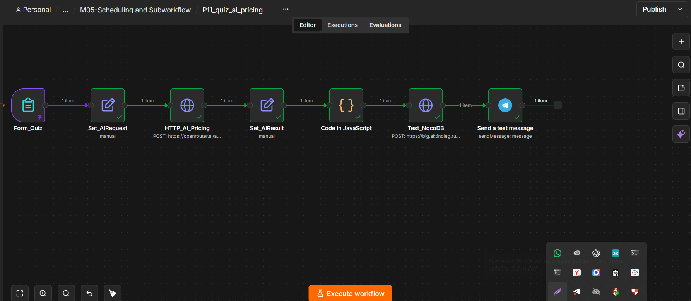
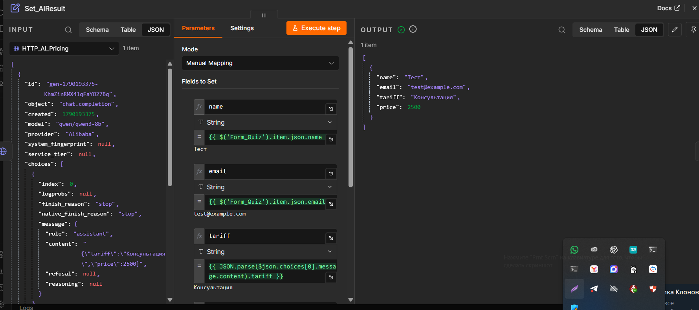
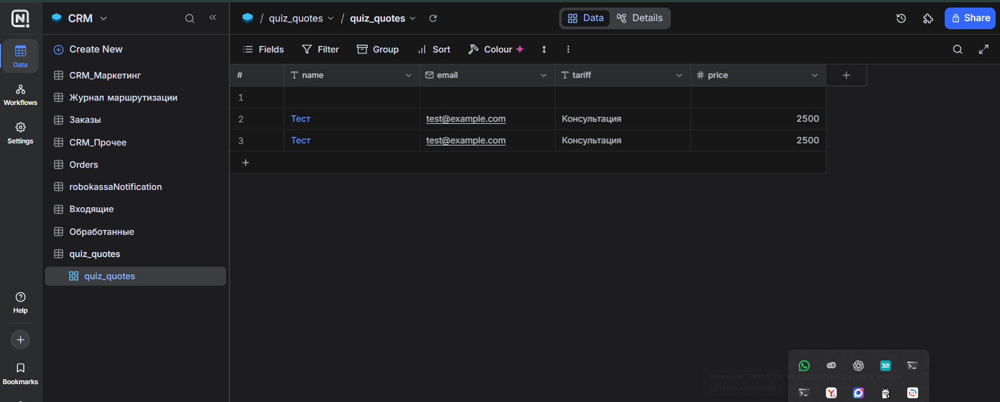
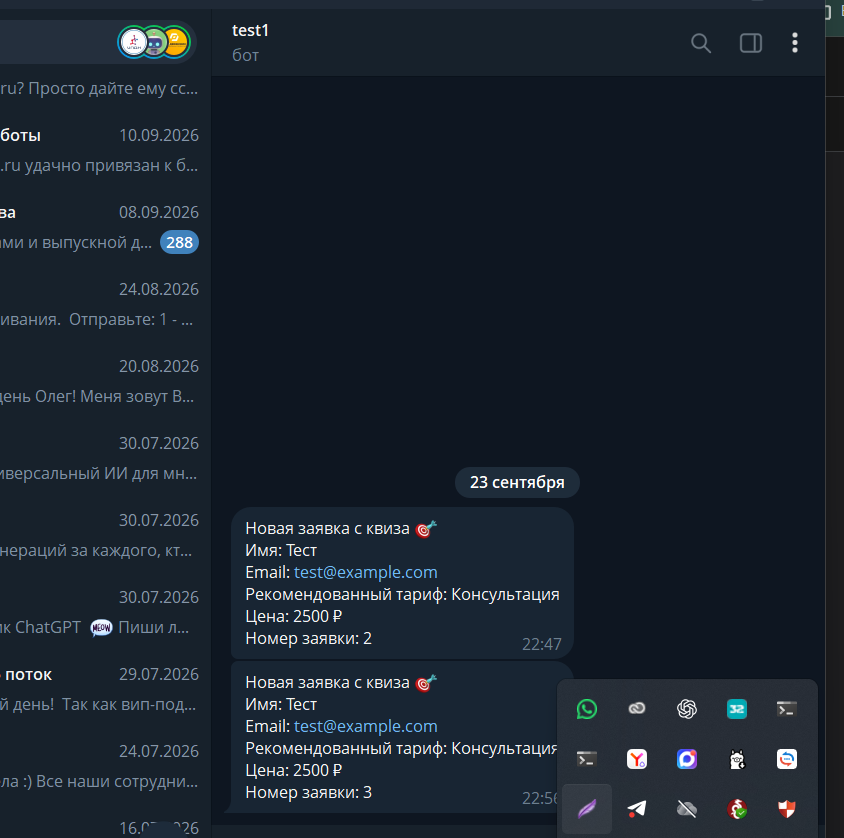

# Квиз с ИИ-подбором предложения

Учебный проект на n8n. Задание принято преподавателем.

## Задача

Собрать данные клиента через мини-квиз, подобрать предварительный тариф,
сохранить заявку и уведомить менеджера.

## Сценарий

Form_Quiz → Set_AIRequest → HTTP_AI_Pricing → Set_AIResult →
проверка JavaScript → HTTP Request к NocoDB → Telegram.

Форма принимает имя, email, тип бизнеса, бюджет и желаемые сроки.
В запрос модели передаются только тип бизнеса, бюджет и сроки.

Ответ ИИ разбирается на tariff (строка) и price (число).
JavaScript проверяет соответствие тарифа и цены учебным правилам.
При несовпадении выполнение останавливается.

Заявка сохраняется в NocoDB, после чего менеджер получает уведомление
в Telegram с контактами, тарифом, ценой и номером записи.

## Подтверждённый результат

- При бюджете 3000 рублей получены тариф «Консультация» и цена 2500 рублей.
- В таблице quiz_quotes создана запись с Id 2.
- Telegram подтвердил доставку уведомления с данными заявки.
- Преподаватель проверил сценарий и скриншоты и принял работу.

Тарифы демонстрационные. Цена зависит только от бюджета.
Это предварительный учебный подбор, а не коммерческая смета.

## Технологии

n8n, OpenRouter, Qwen3-8B, JavaScript, JSON,
NocoDB REST API, Telegram Bot API.

## Материалы

- [Описание проекта](docs/project-description.pdf)
- [Workflow m05-quiz-ai-pricing](workflows/m05-quiz-ai-pricing.json)

## Скриншоты

### Сценарий

### Результат обработки ответа ИИ

### Запись в NocoDB

### Уведомление в Telegram

## Настройка публичного шаблона

1. Импортировать workflows/m05-quiz-ai-pricing.json как отдельный workflow.
2. В HTTP_AI_Pricing выбрать своё подключение OpenRouter API.
3. Создать таблицу quiz_quotes в NocoDB с полями:
   name — текст, email — email, tariff — текст, price — число.
4. В Test_NocoDB заменить YOUR_NOCODB_HOST и YOUR_TABLE_ID в URL.
5. Для этой ноды выбрать Header Auth:
   имя заголовка — xc-token, значение — свой API-токен NocoDB.
6. В Telegram-ноде выбрать подключение своего бота
   и заменить YOUR_TELEGRAM_CHAT_ID на свой Chat ID.
7. Запустить тест формы и проверить запись в базе и сообщение в Telegram.

Test_NocoDB, несмотря на название, выполняет POST и создаёт запись.

Из публичного экспорта удалены ссылки на личные подключения,
закреплённые данные и служебные идентификаторы.
Параметры сервера и получателя заменены заполнителями.
Workflow сохранён неактивным.

## Ограничения

Это учебный прототип. Перед внедрением необходимо согласовать реальные
тарифы, обработку данных, защиту от дублей и действия при сбоях.

Повторный запуск записи может создать новую заявку.
Если отправка в Telegram завершится ошибкой после записи в NocoDB,
заявка останется в базе. Автоматический откат не реализован.