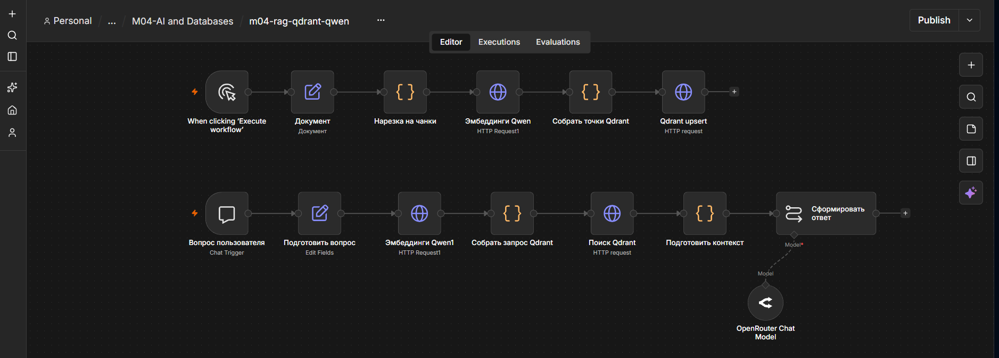
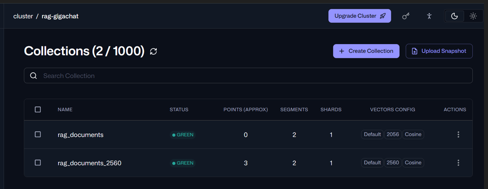
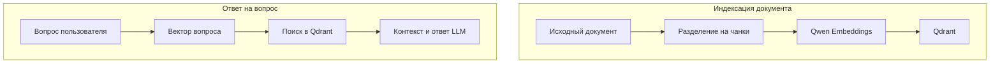

# RAG-ассистент на базе Qdrant и Qwen

Учебно-портфолийный проект интеллектуального помощника на базе n8n. Сценарий загружает документ в векторную базу Qdrant, находит релевантные фрагменты по вопросу пользователя и формирует ответ с помощью языковой модели.



## Задача

Создать RAG-систему, которая:

- принимает исходный документ;
- разделяет его на смысловые фрагменты;
- преобразует фрагменты в векторы;
- сохраняет векторы и исходный текст в Qdrant;
- принимает вопрос пользователя;
- выполняет семантический поиск;
- передаёт найденный контекст языковой модели;
- формирует ответ только на основании базы знаний.

RAG позволяет использовать собственные документы как источник фактов и уменьшает вероятность вымышленных ответов модели.

## Результат

В проекте реализованы два независимых процесса:

1. Индексация документа в Qdrant.
2. Поиск информации и генерация ответа пользователю.

Контрольный вопрос:

> Сколько стоит первая консультация?

Полученный ответ:

> Первая консультация стоит 2500 рублей.

В рабочую коллекцию Qdrant успешно загружены три фрагмента документа.



## Архитектура



## Индексация документа

Верхняя ветка workflow подготавливает базу знаний:

1. **Manual Trigger** запускает загрузку документа.
2. **Документ** содержит текст базы знаний.
3. **Нарезка на чанки** разделяет документ на фрагменты.
4. **Эмбеддинги Qwen** создаёт вектор для каждого фрагмента.
5. **Собрать точки Qdrant** формирует объекты для загрузки.
6. **Qdrant upsert** сохраняет текст, метаданные и векторы.

Настройки разделения документа:

- размер чанка — `1200` символов;
- перекрытие — `100` символов;
- количество полученных фрагментов — `3`.

## Обработка вопроса

Нижняя ветка отвечает пользователю:

1. **Chat Trigger** принимает вопрос.
2. **Подготовить вопрос** нормализует входные данные.
3. **Эмбеддинги Qwen1** создаёт вектор вопроса.
4. **Собрать запрос Qdrant** подготавливает поисковый запрос.
5. **Поиск Qdrant** получает наиболее близкие фрагменты.
6. **Подготовить контекст** объединяет найденные данные.
7. **Сформировать ответ** передаёт контекст языковой модели.
8. **OpenRouter Chat Model** формирует итоговый ответ.

## Технологии

- **n8n** — оркестрация процессов;
- **Qdrant Cloud** — векторная база данных;
- **Qwen3-Embedding-4B** — создание эмбеддингов;
- **DeepInfra API** — выполнение модели эмбеддингов;
- **OpenRouter** — доступ к языковой модели;
- **HTTP Request** — работа с API Qdrant;
- **JavaScript Code nodes** — подготовка чанков, точек и контекста.

## Настройки Qdrant

Финальная коллекция:

| Параметр | Значение |
|---|---|
| Название | `rag_documents_2560` |
| Размер вектора | `2560` |
| Метрика расстояния | `Cosine` |
| Загружено точек | `3` |
| Статус | `GREEN` |

Первоначальная коллекция была создана с размером вектора `2056`, который не соответствовал размерности модели. После диагностики была создана корректная коллекция `rag_documents_2560`.

Этот случай демонстрирует важное правило: размерность коллекции Qdrant должна точно совпадать с размерностью эмбеддингов.

## Структура проекта

```text
rag-qdrant-assistant/
├── README.md
├── diagrams/
├── docs/
├── screenshots/
│   ├── 01-rag-workflow-canvas.png
│   └── 02-qdrant-collection-status.png
└── workflows/
    └── m04-rag-qdrant-qwen.json
```

## Импорт workflow

1. Открыть n8n.
2. Создать новый workflow.
3. Выбрать **Import from File**.
4. Импортировать:

```text
workflows/m04-rag-qdrant-qwen.json
```

5. Подключить собственные credentials.
6. Заменить адрес Qdrant.
7. Проверить название коллекции.
8. Сначала выполнить ветку индексации.
9. Затем протестировать вопрос через Chat Trigger.

## Настройка credentials

После импорта необходимо создать или выбрать:

- credential для OpenRouter;
- credential для API Qdrant;
- доступ к сервису, выполняющему модель эмбеддингов.

В экспортированном workflow используются безопасные значения:

```text
REPLACE_WITH_CREDENTIAL_ID
https://YOUR_QDRANT_HOST
```

Их необходимо заменить собственными настройками внутри n8n.

## Безопасность

Публичная версия проекта не содержит:

- API-ключей;
- токенов авторизации;
- паролей;
- реальных credential ID;
- приватного адреса Qdrant;
- персональных email-адресов.

Секреты должны храниться только в credentials n8n или в переменных окружения.

## Что демонстрирует проект

- проектирование RAG-процесса;
- работу с векторными представлениями текста;
- интеграцию n8n с Qdrant через REST API;
- подготовку данных для семантического поиска;
- использование собственных документов как базы знаний;
- диагностику несовпадения размерности векторов;
- разделение одного workflow на индексацию и поиск;
- безопасную подготовку workflow для публичного репозитория.

## Возможные улучшения

- загрузка документов из внешнего хранилища;
- автоматическое обновление базы знаний;
- добавление источников к каждому ответу;
- фильтрация результатов по метаданным;
- обработка нескольких документов;
- контроль минимального значения релевантности;
- журналирование вопросов и найденных фрагментов;
- отдельная обработка ошибок API.

## Статус

Проект завершён и протестирован.

- документ разделён на чанки;
- эмбеддинги успешно созданы;
- данные загружены в Qdrant;
- семантический поиск работает;
- ответ формируется на основании найденного контекста;
- workflow подготовлен для безопасной публикации.